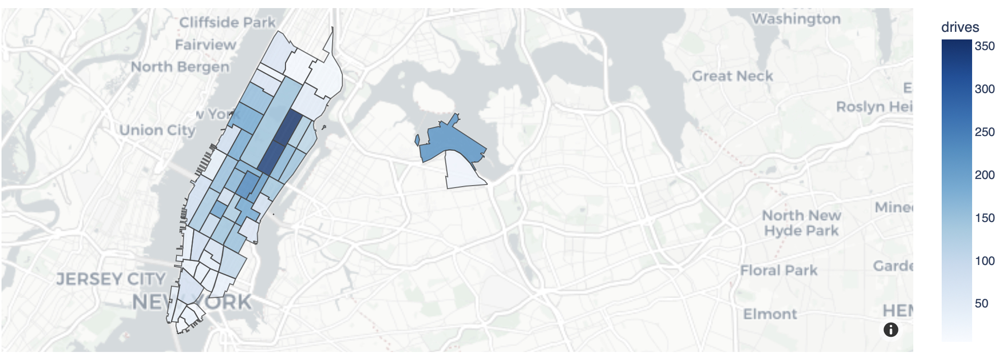
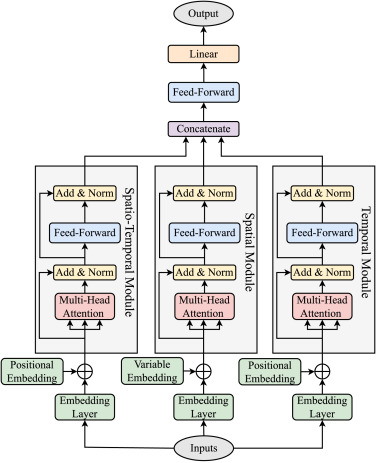
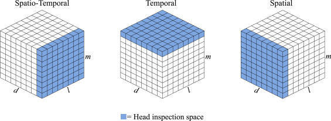
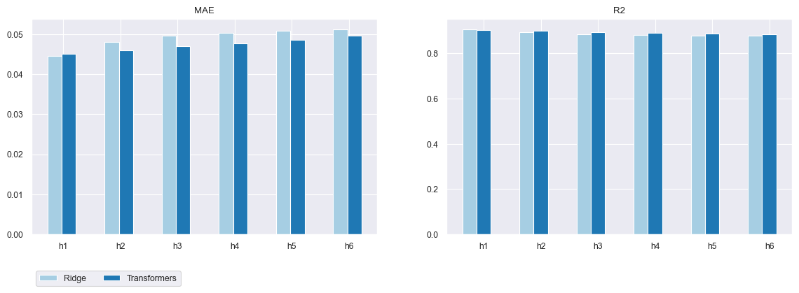
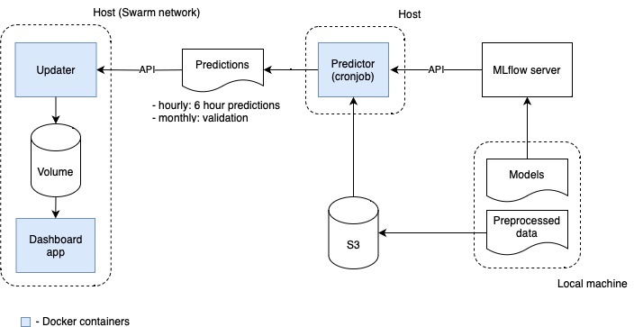

# Yellow New York Taxi Demand multiple Forecasting with spatio-temporal Transformers  <!-- omit in toc -->

**Dashboard:** [link](http://158.160.109.15:8080)

**Tech stack:** Sklearn, Pytorch, FastAPI, MLflow, Docker, Swarm, Gitlab CI/CD

Having engaged in several projects involving simultaneous forecasting of multiple time-series, I've consistently pondered the challenge of incorporating cross-relationships among predicted values. This task is not easy; even in the case of a moderate number of predicted values, it can only be solved by appealing to domain knowledge. The potential of transformers in addressing this issue has caught my attention, supported by many articles exploring their efficacy in such or similar scenarios.

In this personal project, I had set two goals for myself:

1. Experiment with the application of transformers to address the complexities of multiple time series forecasting.
2. Hone my skills in developing end-to-end machine learning projects, emphasizing both development aspects and the implementation of MLOps practices.

As a game problem, I took a multivariate zonal demand forecasting problem for yellow taxis in New York City. I was familiar with the dataset as I had developed a prediction algorithm in May 2020 (it was my first ML project) that I could use now also as a baseline solution.

### Table of Contents <!-- omit in toc -->
- [Problem statement ](#problem-statement-)
- [Baseline Solution ](#baseline-solution-)
- [Spatio-Temporal Transformers ](#spatio-temporal-transformers-)
- [App Schema and Deployment ](#app-schema-and-deployment-)

### Problem statement 
Develop a forecasting model that predicts demand on yellow taxi in each specific geographic zone in New York City over a 6-hour horizon. 

Data: [TLC Trip Record Data](https://www.nyc.gov/site/tlc/about/tlc-trip-record-data.page). Out of more than 250 zones, 55 were selected that have an average value of more than 5 trips per hour.

Disclaimer: Since the goal was to experiment with different types of ML / DL approaches and I was interested in relative quality, I did not attempt to use any external information (e.g., weather forecasts) and limited myself to data from the original dataset.

### Baseline Solution 
Experimenting with different models (ARIMA models for time series clusters and different regressors for the this approach), I settled on a liner ridge regression (6 models, one for each forecasting hour) accompanied by complex feature engineering. The solution was based on two key ideas:
1. use of Fourier harmonics for modelling larger fluctuation periods
2. using the Cartesian product for the base features and zones id / hours
   
As base features I took autoregressive number of trips (-1, -2, ..., -24, -48, ... hours), as well as average trips information in the last hour (distance, cost, drive time, etc.).
On the test period, the model performed moderately well. For normalized values depending on 
prediction hour horizon, $MAE$ and $R^2$ metrics varied:
- $MAE$ from 0.04457 till 0.05129
- $R^2$ from 0.90793 till 0.87887 

See chart bellow for details.

Taking into account the significant deviation of absolute demand by zones (and, as a consequence, the different variance), this approach can be considered quite successful.

### Spatio-Temporal Transformers 
The idea to apply transformers to simultaneous multiple time-series forecasting came to me when I was first acquainted with this architecture. One can consider the problem as predicting the states of some system, with some representation in $R^n$, with $n$ equal to the number of time series. This problem statement is very similar to that of text generation or machine translation. After doing some research, I came across an article: [STTRE: A Spatio-Temporal Transformer with Relative Embeddings for multivariate time series forecasting](https://www.sciencedirect.com/science/article/pii/S0893608023005361?ssrnid=4404879&dgcid=SSRN_redirect_SD), that resonated with my own thoughts and can be adjusted for my problem.

The Spatio-Temporal Transformer architecture proposed in the paper is shown in the following diagram:

The main idea of the approach lays in using different embedding layers, which allows a finer detection of spatio-temporal dependencies:

The original paper was aimed at predicting the next value of a single time series, so I had to modify the architecture a bit for my purposes: 
1. replace the embedding layers transformation $R \to R^d$ with $R^k \to R^d$ one ($d$ - embedding dim), that allowed me to take into account additional information about trips, contained in the data (avg. cost, distance, day of the week and so on),
2. modify the regression head, replacing single value regression with multiple regression (n of zones * 6 hour horizon) and adding some additional information (in my case -1, -2 weeks demand for each forecasting hour) to the transformer output.

After spending a few days experimenting with different architecture and hyper-parameters, I was able to slightly outperform the base-line model results for prediction hours greater than 1:

**Some conclusions:** 
1. The approach works! Incorporation of cross-relationships among zones could outperform Fourier harmonics, that were crucial for the baseline solution (and that work good in case of multi-periodical time series).
2. There was clearly insufficient data. Using data more than a year and a half old decreased performance (obvious data shift). The lightest architecture (4 hours sequence, 16 embedding dim, 1 encoding block) showed the best performance.
3. Difficult to train and tune. High dependence on architecture parameters.

### App Schema and Deployment 
The second goal of the project was to develop an end-to-end ML app and to practice with MLOps. 

The developed app is a simulation of real-time short-run hourly updated zonal forecast. The entire process is illustrated in the following diagram:

 

Main tech details:
1. Gitlab CI / CD
2. Containerized cronjob of prediction process
3. Simple microservices architecture (interprocess communication by API)
4. Using MLflow as model and artifacts registry
5. Docker Swarm orchestration
6. Local Docker registry for Swarm

My former colleague helped me with the [front-end design](./dashboard/assets) of the plotly dashboard.
